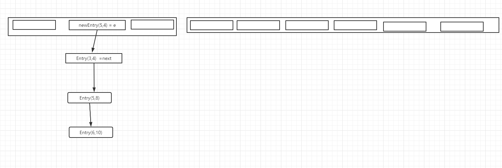

## jdk1.7  HashMap 源码分析

## 构造方法

1. 调用无参构造函数，构造一个HashMap

```java
 // DEFAULT_INITIAL_CAPACITY 默认的数组长度为16，DEFAULT_LOAD_FACTOR 默认的加载因子为0.75
 public HashMap() {
        this(DEFAULT_INITIAL_CAPACITY, DEFAULT_LOAD_FACTOR);
 }
 
 
//构造hashMap
 public HashMap(int initialCapacity, float loadFactor) {
        if (initialCapacity < 0)
            throw new IllegalArgumentException("Illegal initial capacity: " +
                                               initialCapacity);
        if (initialCapacity > MAXIMUM_CAPACITY)
            initialCapacity = MAXIMUM_CAPACITY;
        if (loadFactor <= 0 || Float.isNaN(loadFactor))
            throw new IllegalArgumentException("Illegal load factor: " +
                                               loadFactor);
        // 加载因子
        this.loadFactor = loadFactor;
        //默认长度
        threshold = initialCapacity;
        init();
 }

// init 为空 linkhashmap  重写了改方法
void init() {
 }

```

## 2.调用put 方法

```java
    public V put(K key, V value) {
        // 判断table是否为空，为空就初始化table
        if (table == EMPTY_TABLE) {
            inflateTable(threshold);
        }
        //放入key为null的元素，放在table[0]里
        if (key == null)
            return putForNullKey(value);
        //根据key 计算hash值
        int hash = hash(key);
        // 根据hash值 和数组长度计算需要放入的数组的下标
        int i = indexFor(hash, table.length);
        // 遍历链表,如果已经key相同的元素（hash值相同 并且 (== 或者 equal 相同）,就覆盖原值，返回老的元素值
        for (Entry<K,V> e = table[i]; e != null; e = e.next) {
            Object k;
            if (e.hash == hash && ((k = e.key) == key || key.equals(k))) {
                V oldValue = e.value;
                e.value = value;
                e.recordAccess(this);
                return oldValue;
            }
        }
        modCount++;
        // 没有key相同的元素，就实例化entry，加入链表里。
        addEntry(hash, key, value, i);
        //返回空值
        return null;
    }
```


2.1 inflateTable 初始化table

```java
//入参 初始化的数组长度
private void inflateTable(int toSize) {
    //根据需要初始化数组长度，所以要找到“大于”toSize的“最小的2的n次方”
    int capacity = roundUpToPowerOf2(toSize);
    // 计算扩容阈值，扩容阈值 =  数组长度 *  加载因子
    threshold = (int) Math.min(capacity * loadFactor, MAXIMUM_CAPACITY + 1);
    // 初始化数组长度
    table = new Entry[capacity];
    initHashSeedAsNeeded(capacity);
}
```


2.2 roundUpToPowerOf2 (toSize)

```java
   private static int roundUpToPowerOf2(int number) {
        //计算查找接近入参的2的次方数
        return number >= MAXIMUM_CAPACITY
                ? MAXIMUM_CAPACITY
                : (number > 1) ? Integer.highestOneBit((number - 1) << 1) : 1;
    }
```

Integer.highestOneBit  作用计算查找小于等于入参的2的次方数

```java
public static int highestOneBit(int i) {
    // HD, Figure 3-1
    i |= (i >>  1);
    i |= (i >>  2);
    i |= (i >>  4);
    i |= (i >>  8);
    i |= (i >> 16);
    return i - (i >>> 1);
}
```

````java
    public static void main(String[] args) {
        System.out.println(Integer.highestOneBit(6));  // 4
        System.out.println(Integer.highestOneBit(8));  // 8
        System.out.println(Integer.highestOneBit(10)); // 8
        System.out.println(Integer.highestOneBit(31)); //16
    }
````


比如传入 10,  二级制为 0000 1010, 最终计算出来是8

```
//i |= (i >>  1);
0000 1010
0000 0101
0000 1111   

// i |= (i >>  2);
0000 1111
0000 0011
0000 1111

//不会变
0000 1111
0000 0111
0000 1000  == 8
```

 

2.3 putForNullKey  (HashMap 的key 可以为null)

```java
private V putForNullKey(V value) {
    // key 为null 的entity，放在数组下标为0 的位置
    // 遍历下标为0 处的链表，如果找到key 为null的，就覆盖原值，返回老的值
    for (Entry<K,V> e = table[0]; e != null; e = e.next) {
        if (e.key == null) {
            V oldValue = e.value;
            e.value = value;
            e.recordAccess(this);
            return oldValue;
        }
    }
    modCount++;
    // 如果没找到就头插法加入链表里，并返回空值
    addEntry(0, null, value, 0);
    return null;
}
```


2.4   计算key的hash值后进行左移和^(相同为1，不同为0)，是为了把key的hashcode的高位移动到低位，是高位也参数到index的计算，使得hash值 更散列，最终计算出的index 也更散列

```java
 final int hash(Object k) {
        int h = hashSeed;
        if (0 != h && k instanceof String) {
            return sun.misc.Hashing.stringHash32((String) k);
        }

        h ^= k.hashCode();

        // This function ensures that hashCodes that differ only by
        // constant multiples at each bit position have a bounded
        // number of collisions (approximately 8 at default load factor).
        h ^= (h >>> 20) ^ (h >>> 12);
        return h ^ (h >>> 7) ^ (h >>> 4);
    }
```

2.5  计算index

```java
    /**
     * Returns index for hash code h.
     */
    static int indexFor(int h, int length) {
        // assert Integer.bitCount(length) == 1 : "length must be a non-zero power of 2";
        return h & (length-1);
    }

```

   计算 下标是通过   hash值 和 （数组长度减一） 进行与运算 计算出的，目的是为了把数据分配的更均匀。 

  比如 默认的数组长度为 16  二进制位 0001 0000

 16-1 = 15  ， 15 的二进制位 0000 11111

 hash值为  

 hash  &  0000 1111 的结果是否离散，就取决于hash值是否离散。


2.6  void addEntry(int hash, K key, V value, int bucketIndex)   如果hashmap里不存在相同的元素，就需要把元素放到数组或者链表里

```java
 void addEntry(int hash, K key, V value, int bucketIndex) {
        //判断是否需要扩容。扩容的条件是map数组的元素总数大于等于扩容阈值，数组的index位置的元素不为null
        if ((size >= threshold) && (null != table[bucketIndex])) {
            resize(2 * table.length);
            hash = (null != key) ? hash(key) : 0;
            bucketIndex = indexFor(hash, table.length);
        }
        // 构造entry 并且维护链表关系
        createEntry(hash, key, value, bucketIndex);
    }
```


 先看createEntry方法，

```java
// 基于头插法构造链表  
void createEntry(int hash, K key, V value, int bucketIndex) {
        Entry<K,V> e = table[bucketIndex];
        table[bucketIndex] = new Entry<>(hash, key, value, e);
        //增加hashmap元素的数量
        size++;
    }

     Entry(int h, K k, V v, Entry<K,V> n) {
            value = v;
            next = n;
            key = k;
            hash = h;
        }

```


加入bucketIndex = 2， 那么此时e = table[bucketIndex]  指向链表的头结点,对应Entry(3,4).

 new Entry<>(hash, key, value, e);  构造一个新的entry 存放新的key，并把next指向e，此时链表变为

​                                                                

把构造的新的entry ，赋值给链表的头结点，也就是数据的index 位置的元素，此时链表变为

​                                              

   

##  HashMap 扩容

   当hashmap中的元素数量超过阈值，并且要方入得index位置的数组元素不为null 时候，会触发扩容，扩容时候回重新计算元素要存放的位置，目的是减少链表的长度，提高查询效率。

```java
    void addEntry(int hash, K key, V value, int bucketIndex) {]
        
        if ((size >= threshold) && (null != table[bucketIndex])) {
            //扩容，长度为原来的二倍
            resize(2 * table.length);
            hash = (null != key) ? hash(key) : 0;
            //计算新元素的下标
            bucketIndex = indexFor(hash, table.length);
        }

        createEntry(hash, key, value, bucketIndex);
    }

```


```java

  void resize(int newCapacity) {
        // 保存老的table 的引用
        Entry[] oldTable = table;
        // 老table的长度如果已经最大值，那么不在扩容
        int oldCapacity = oldTable.length;
        if (oldCapacity == MAXIMUM_CAPACITY) {
            threshold = Integer.MAX_VALUE;
            return;
        }
        // 构造长度为原来二倍的数组
        Entry[] newTable = new Entry[newCapacity];
        //重新计算各个元素在新的数组中存放的位置
        transfer(newTable, initHashSeedAsNeeded(newCapacity));
        // table 指向新的数组
        table = newTable;
        // 计算新的扩容阈值
        threshold = (int)Math.min(newCapacity * loadFactor, MAXIMUM_CAPACITY + 1);
    }
```


  主要看transfer 方法。

  ```java
    void transfer(Entry[] newTable, boolean rehash) {
        int newCapacity = newTable.length;
        // 遍历数组的元素
        for (Entry<K,V> e : table) {
            //遍历链表
            while(null != e) {
                Entry<K,V> next = e.next;
                if (rehash) {
                    e.hash = null == e.key ? 0 : hash(e.key);
                }
                //根据新的长度重新计算index
                int i = indexFor(e.hash, newCapacity);
                //头插法，讲引用方到正确的位置
                e.next = newTable[i];
                newTable[i] = e;
                e = next;
            }
        }
    }
  ```

 其实 newTable[i] = null， e.next = newTable[i] 都指向了null

  

  newTable[i] = e ,   e = next;后，newTable[i]指向了e


下一次循环如果 Entry[3,4]，也放在index 为3 的位置，那么

