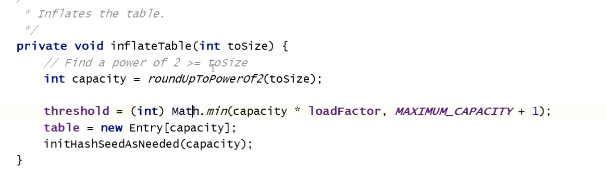
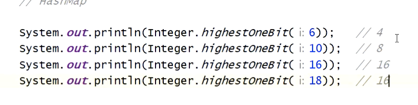
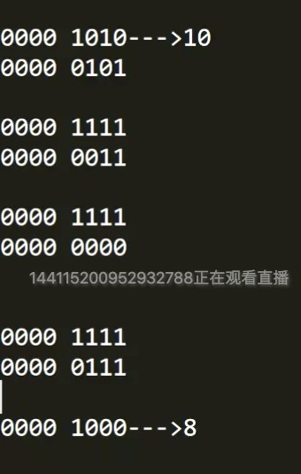
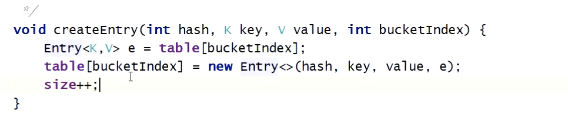
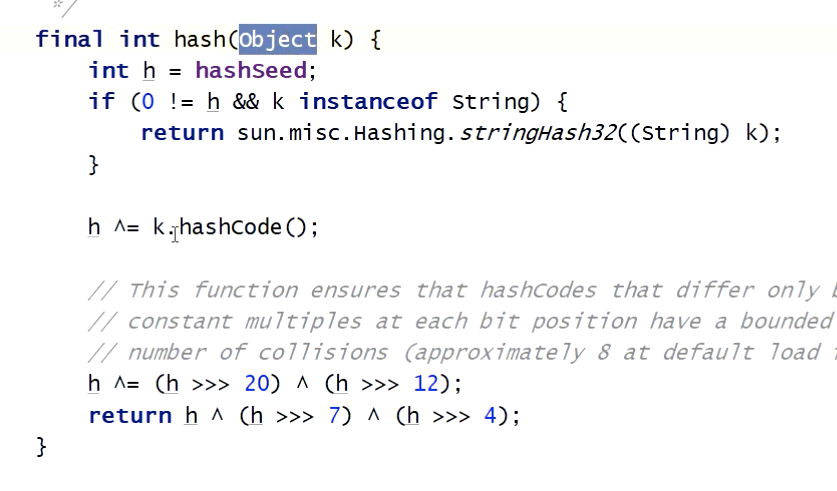
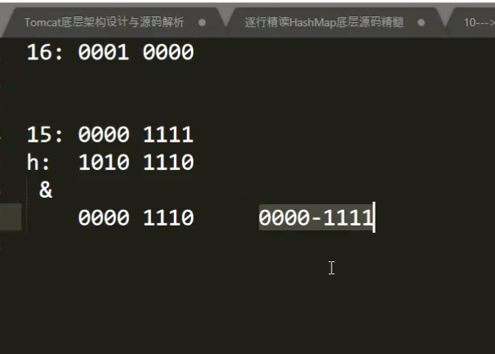
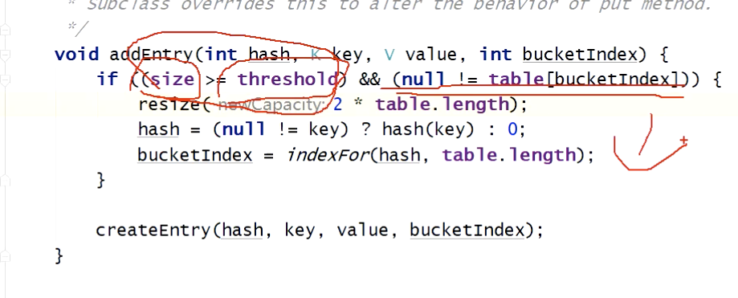
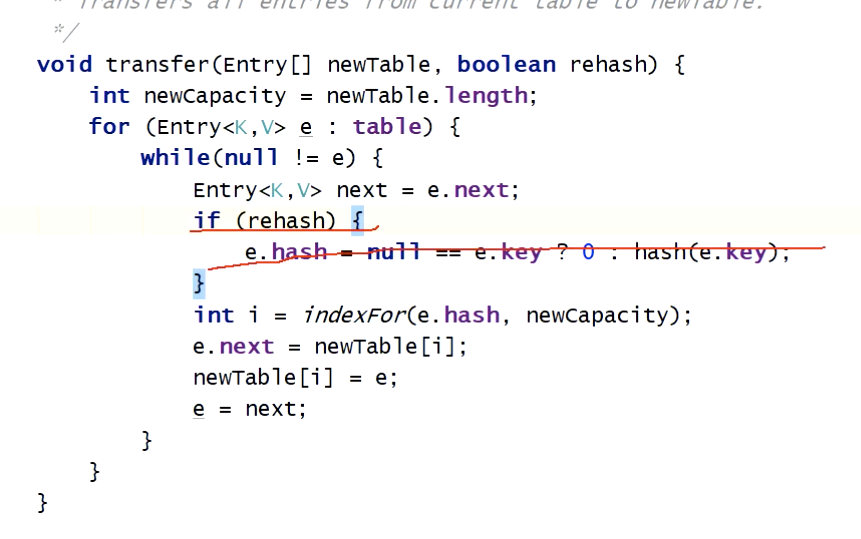

Hashmap  的put方法，返回值是 oldvalue

放入内部的元素是 entry（key,value）

key下标的处理

hashcode -->  hashcode % 数组长度 

jdk7 头插法

newEntry = new Entry(key,value);

newEntry.next = table[index];

Table[index] = newEntry;

Size  hashmap 总的entry 数量

put 方法进行初始化

Rounduptopowerof2  根据size 查找2的幂次方的数据长度

Highestonebit  作用查找小于等于入参的2的次方数

原理：  传入10 

为什么要移动32 ： 因为int 一共4个字节 一个字节 8位

头插法 加移动

计算hashcode

​       indexfor  返回的数字比较均衡

​     

​    

length 是2的幂次方， 减一 以后 会把 低位 全改为1

 减一的目的是  让高位 变为0  低位 变为1，这样与运算 才会 离散均匀

扩容

 扩容条件

​         重新计算后  要么是原位置 要么是倍数位置

​       头插法  容易出现死循环

​      hash 种子，重新计算，防止hash 的位置只有两个

#  jdk8

链表长度大于8时候，会转化为红黑树

remove 操作，导致链表长度小于等于6 时候，会转化为 链表

为什么 jdk 7 和jdk 8 计算hash 方法不一样，以为jdk 8 中链表边长了后变为红黑树，红黑树的查询效率高，

为什么jdk8  新的元素不是基于头插法而是加载链表尾部，因为没加入一个元素都需要判断是否需要树化，需要判断链表的长度，需要循环，既然后循环了，那就直接加入尾部