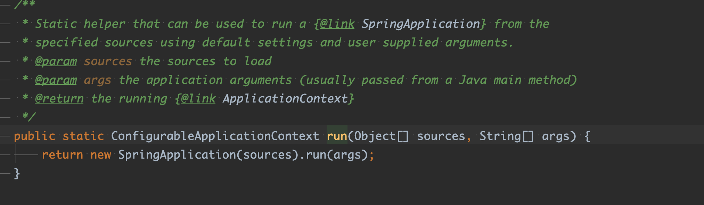
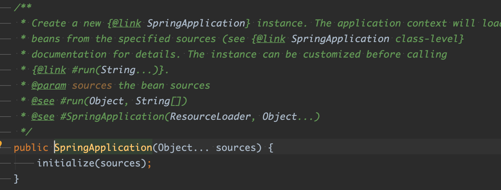
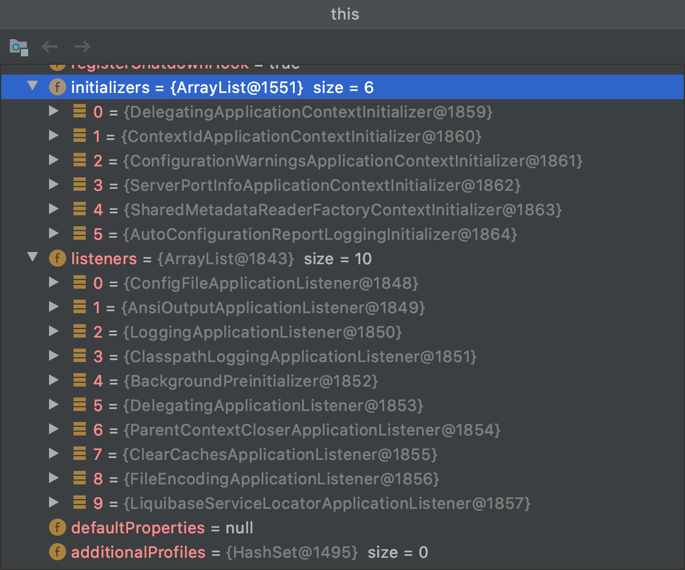
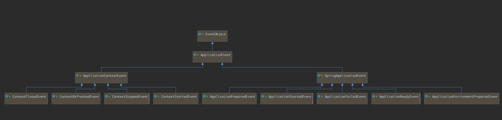

### spring-boot 启动过程分析

## 1. SpringApplication.java 中

在main方法中调用SpringApplication的run方法



初始化SpringApplication



````java
@SuppressWarnings({ "unchecked", "rawtypes" })
	private void initialize(Object[] sources) {
		if (sources != null && sources.length > 0) {
			this.sources.addAll(Arrays.asList(sources));
		}
    // 判断是否是web环境
		this.webEnvironment = deduceWebEnvironment();
    //从fav文件里获取初始化的类
		setInitializers((Collection) getSpringFactoriesInstances(ApplicationContextInitializer.class));
    // 从fav文件里获取listen        
		setListeners((Collection) getSpringFactoriesInstances(ApplicationListener.class));
    // 推断出main
		this.mainApplicationClass = deduceMainApplicationClass();
	}
````

   1.   deduceWebEnvironment()方法主要是判断在classload 下是否有 javax.servlet.Servlet  和  org.springframework.web.context.ConfigurableWebApplicationContext  两个类来判断的。如果有 则认为是web环境，否则就不是web环境。

```java
private boolean deduceWebEnvironment() {
   for (String className : WEB_ENVIRONMENT_CLASSES) {
      if (!ClassUtils.isPresent(className, null)) {
         return false;
      }
   }
   return true;
}

	private static final String[] WEB_ENVIRONMENT_CLASSES = { "javax.servlet.Servlet",
			"org.springframework.web.context.ConfigurableWebApplicationContext" };
```


2.  	setInitializers((Collection) getSpringFactoriesInstances(ApplicationContextInitializer.class))

   从 META-INF/spring.factories 文件中加载并初始化 实现 ApplicationContextInitializer 的类，并赋值给 SpringApplication. initializers

   

3. ​	setListeners((Collection) getSpringFactoriesInstances(ApplicationListener.class)) 

   从 META-INF/spring.factories 文件中加载并初始化 实现 ApplicationListener 的类，并赋值给 SpringApplication. listeners

   

   

   最中的SpringApplication 类:




## 2. 调用SpringApplication的run方法

  

