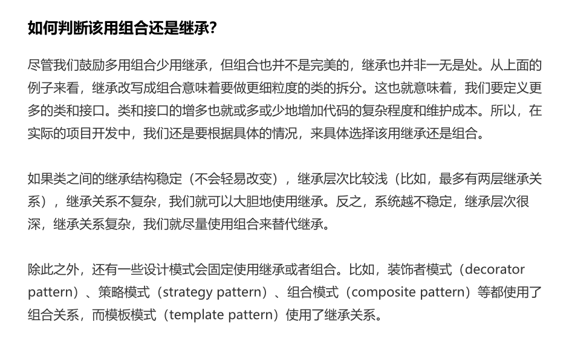
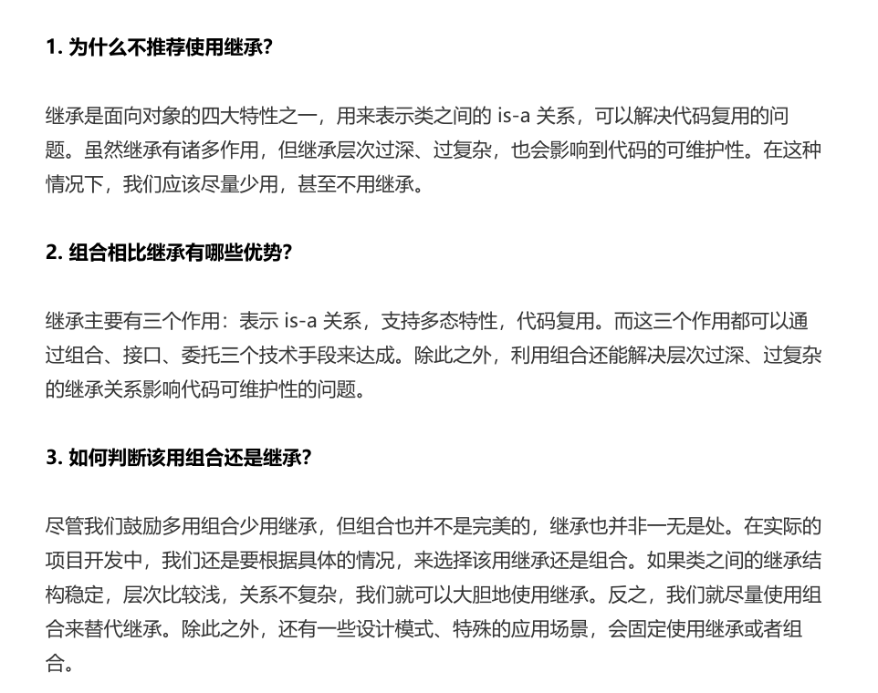
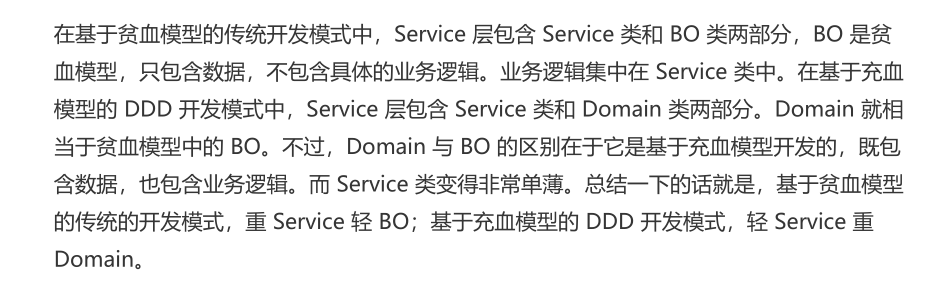

> 抽象类更多是为了代码复用，接口侧重于解耦，相当于是一组协议或者契约。 如果是is -a 的关系，用抽象类，如果是has-a的关系 用接口

### 基于接口编程而非基于实现编程

1. 函数的命名不能暴露任何的实现细节。
2. 封装具体的实现。
3. 为i抽象类定义抽象的接口，具体的实现类都以来统一的接口定义。使用者依赖接口，而不是具体的实现类来编程

### 多用组合少用继承

### 类与类之间的关系

1.  泛华   可以理解为简单的继承关系

2. 实现  一般指接口和实现类之间的关系，

3. 聚合： 是一种包含关系，A类对象包含了B类对象，B类对象的生命周期可以不依赖A类对象的生命周期，也就是说可以单独销毁A对象而不影响B对象。比如课程与学生的关系。

4. 组合：也是一种包含关系，A类对象包含了B类对象，B类对象的生命周期依赖A类对象的生命周期，B类对象不可单独存在，比如鸟与翅膀的关系。

5. 关联： 一种非常弱的关系，包含了聚合和组合两种关系。如果B类对象是A类对象的成员变量，那B类对象和A类对象就是关联关系

6. 依赖：一种比关联关系更加弱的关系，包含了关联关系。不管B类对象是A类对象的成员变量，还是A类对象的方法使用了B类对象作为参数或者返回值，局部变量，

   

   