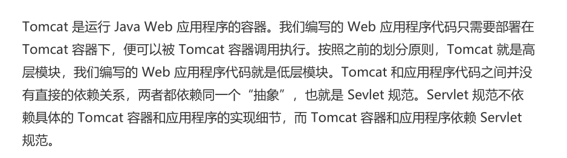
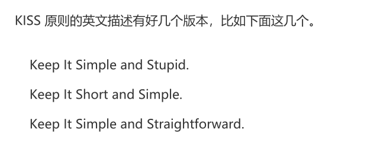
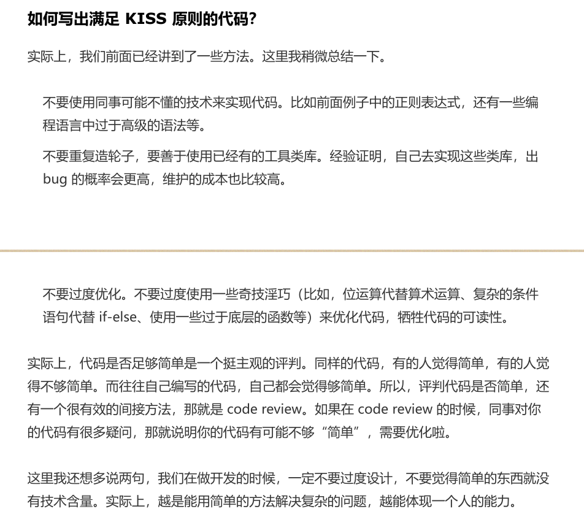

## 设计原则

### SOLID 原则

##### 单依职责原则

一. 判断一个类的职责够不够单一

       1.  类中的代码行数过多，函数或者属性过多，会影响代码的可读性和可维护性，需要考虑对类进项拆分
          2.  类依赖的其他类过多，或者依赖类的其他类过多，不符合高内聚，低耦合的设计思想，就要考虑对类进行拆分。
          3.  私有方法过多，我们就要考虑是否讲私有方法独立到新的类中，设为public方法，供更多类使用，从而提高代码复用性
          4.  比较难给类起一个合适的名字，很难用一个业务名词概括，就说明类的职责定义不够明确
          5.  类中大量的方法都在集中操作类的某几个属性，那就可以考虑将这几个属性和对应的方法独立出来。  

##### 开闭原则

> 对扩展开放，对修改关闭（添加一个新的功能应该是在已有代码的基础上扩展代码，而非修改已有的代码）

##### 里式替换原则

> 子类对象能够替换程序中父类对象出现的任何地方，并且保证原来程序的逻辑行为不变以及正确性不被破坏。是用来指导继承关系中子类应该如何设计

子类在设计的时候，要遵守父类的行为约定。父类定义了函数的行为约定，那子类可以改变函数的内部实现逻辑，但不能改变函数的原有的行为约定。包括：函数声明要实现的功能; 对输入输出，异常的约定

##### 接口隔离原则

> 客户端不应该强迫依赖它不需要的接口

接口隔离原则提供了一种判断接口的职责是否单一的标准。如果调用者只使用了部分接口或接口的部分功能，那接口的设计就不够职责单一。比如Api使用者只需要查询用户，不允许删除用户。只有管理员才可以删除用户。就需要把删除用户接口和查询接口分离开来。

##### 依赖反转原则

> 在没有使用反转之前，程序员自己控制整个程序的执行。在使用了框架之后，这个程序的执行流程可以通过框架来控制。流程的控制权从程序员反转到了框架。
>
> 高层模块不要依赖底层模块。高层模块和底层模块应该通过抽象来相互依赖。抽象不要依赖具体实现细节，具体实现细节依赖抽象。

1. 

​        

1. 依赖注入

   不通过new的方式在类内部创建依赖类对象，而是讲依赖的类的对象在外部创建好，通过构造函数，函数参数等方式传递（注入）给类使用

###### kiss原则

##### YAGNI原则

>不要去设计当前用不到的功能；不要去编写当前用不到的代码。实际上，这条原则的设计核心思想就是：不要过度设计

##### DRY原则

> Do not Repeat Yourself。 中文直译为：不要重复自己。将它应用在编程中，可以理解为：不要写重复的代码

###### 提高代码复用性

1.  减少耦合代码

​          在高度耦合的代码中，当我们希望复用其中一部分代码，想把这部分功能的代码抽取出来成为一个独立的模块，类或者函数的时候，往往发现牵一发而动全身。移动一点代码，就要连到很多其他相关的代码。所以高度耦合的代码会影响到代码的复用性，我们要尽量减少代码耦合。

2.   满足单一职责原则
3. 模块化

​         我们要将功能独立的代码封装成模块。独立的模块就像一块块的积木，更加容易复用，可以直接拿来搭建更加复杂的系统。

4. 业务和非业务逻辑分离

    越是跟业务无关的代码越是容易复用，越是针对特定业务的代码越难复用。所以为了复用跟业务无关的代码，我们将业务和非业务逻辑代码分离，抽里成一些通用的框架，类库，组件

5. 通用代码下沉

6. 继承，多态，抽象，封装

7. 应用模板等设计模式

##### 迪米特法则

> 利用迪米特法则可以帮助我们实现代码的高内聚，松耦合。

###### 高内聚，松耦合

-    高内聚

  所谓高内聚，是指相近的功能应该放在同一个类中，不想进的功能不要放在同一个类中。相近的功能往会被同时修改，放在同一个类中，修改会比较集中，代码容易维护。单一职责原则是实现代码高内聚非常有效的设计原则。

- 松耦合

​       在代码中，类和类之间的依赖关系简单清晰。即使两个类有依赖关系，一个类的代码改动不会或者很少导致依赖类的代码改动。依赖注入，接口隔离，基于接口而非实现编程，以及迪米特法则，都是为了实现代码的松耦合。

###### 迪米特法则

​    不该有直接依赖关系的类之间，不要有依赖；有依赖关系的类之间，尽量只依赖必要的接口

